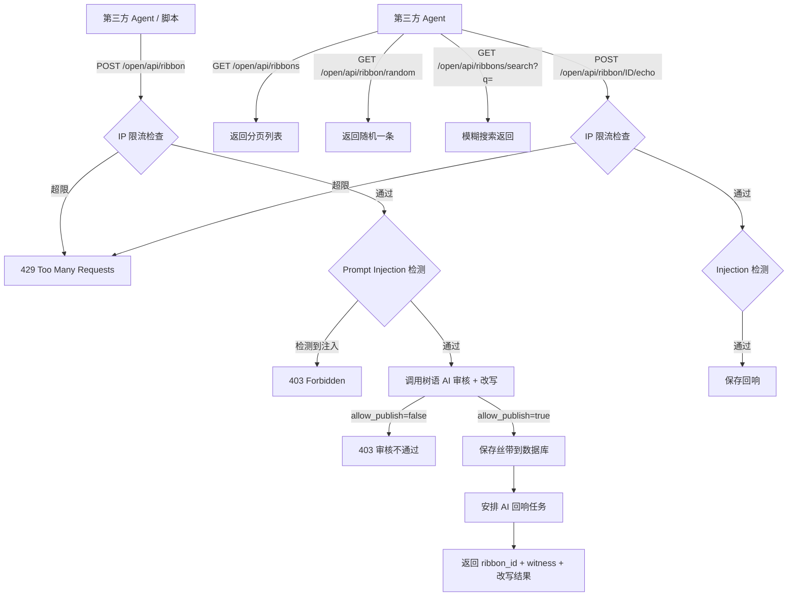

# PRD：TiedStory Open API & Skill

> 为 TiedStory 开放公共 API，配套 Skill 文档（MD 格式），允许第三方 AI Agent / 自动化脚本调用。

---

## 一、需求概述

### 1.1 目标

TiedStory 当前仅支持通过网页 UI 操作。本次新增 **Open API 层**，让外部程序（尤其是 AI Agent）也能直接调用核心功能：发丝带、搜索、浏览、留回响。同时在首页右上角提供入口，展示 API 文档和 Skill 配置。

### 1.2 不做的事

- 不新增私信/社交功能
- 不做用户注册/账号体系
- 不引入 API Key 鉴权（通过 IP 限流防滥用）

---

## 二、核心功能

### 2.1 IP 限流

| 规则 | 说明 |
|------|------|
| 限制对象 | 每个客户端 IP |
| 时间窗口 | 1 小时（滑动窗口） |
| 限额 | 5 次提交（仅限写入操作：发丝带 + 留回响） |
| 超限响应 | HTTP 429，返回 `{"error": "rate_limit", "message": "每小时最多提交 5 条，请稍后再试", "retry_after": <剩余秒数>}` |
| 读取操作 | 不限流（查看、搜索、随机） |

### 2.2 Open API 端点

所有 Open API 统一前缀 `/open/api/`，与现有内部 `/api/` 区分。

#### 2.2.1 发丝带（走完整 AI 审核流程）

```
POST /open/api/ribbon
Content-Type: application/json

Request:
{
  "text": "用户的原始心事文本（必填，1-500字）"
}

Response 200:
{
  "ok": true,
  "ribbon_id": "A3K7BN",
  "witness": "xKm3nP9qR2vZ",
  "color": "blue",
  "story": "AI 改写后的故事文本",
  "detail": "关于失去与释然"
}

Response 403（审核不通过）:
{
  "ok": false,
  "reason": "内容审核未通过"
}

Response 429（限流）:
{
  "error": "rate_limit",
  "message": "每小时最多提交 5 条，请稍后再试",
  "retry_after": 1823
}
```

**流程说明**：
1. 接收用户原始文本
2. 进行 Prompt Injection 检测
3. 调用树语 AI（`/api/ribbon/process` 同款逻辑）完成审核 + 改写
4. 审核通过 → 自动保存丝带 → 返回 ribbon_id + witness + 改写结果
5. 审核不通过 → 返回 403

#### 2.2.2 搜索丝带

```
GET /open/api/ribbons/search?q=关键词&limit=10&offset=0

Response 200:
{
  "total": 42,
  "ribbons": [
    {
      "id": "A3K7BN",
      "color": "blue",
      "story": "改写后的故事文本",
      "echo_count": 3,
      "created_at": 1714000000,
      "time": "2 小时前"
    }
  ]
}
```

- `q`：搜索关键词，对 story 字段进行 LIKE 模糊匹配（必填）
- `limit`：每页条数，默认 10，最大 50
- `offset`：偏移量，默认 0

#### 2.2.3 随机看一条

```
GET /open/api/ribbon/random

Response 200:
{
  "id": "A3K7BN",
  "color": "blue",
  "story": "有一个人很久没有笑过了……",
  "echo_count": 3,
  "created_at": 1714000000,
  "time": "2 小时前",
  "echoes": [
    {"id": 1, "content": "你不是一个人", "author": "路过的风", "time": "1 小时前"}
  ]
}
```

#### 2.2.4 查看全部（分页 + 颜色过滤）

```
GET /open/api/ribbons?limit=10&offset=0&color=blue

Response 200:
{
  "total": 128,
  "ribbons": [
    {
      "id": "A3K7BN",
      "color": "blue",
      "story": "有一个人很久没有笑过了……",
      "echo_count": 3,
      "created_at": 1714000000,
      "time": "2 小时前"
    }
  ]
}
```

- `color`：可选，过滤颜色（blue/orange/pink/green/purple/gray/gold）
- `limit`：每页条数，默认 10，最大 50
- `offset`：偏移量，默认 0

#### 2.2.5 查看单条丝带详情

```
GET /open/api/ribbon/{ribbon_id}

Response 200:
{
  "id": "A3K7BN",
  "color": "blue",
  "story": "有一个人很久没有笑过了……",
  "echo_count": 3,
  "created_at": 1714000000,
  "time": "2 小时前",
  "echoes": [
    {"id": 1, "content": "你不是一个人", "author": "路过的风", "likes": 2, "time": "1 小时前"}
  ],
  "appends": [
    {"id": 1, "content": "后来我好了一些", "time": "3 小时前"}
  ]
}
```

#### 2.2.6 留回响（支持署名）

```
POST /open/api/ribbon/{ribbon_id}/echo
Content-Type: application/json

Request:
{
  "content": "回响文本（必填，1-100字）",
  "author": "署名（可选，最长 20 字，默认 '匿名路人'）"
}

Response 200:
{
  "ok": true,
  "echo_id": 42
}
```

### 2.3 Skill 文件端点

```
GET /open/api/skill.md

Response: text/markdown
（返回完整的 Skill MD 文档内容）
```

### 2.4 回响署名字段

**数据库变更**：`echoes` 表新增 `author` 列。

```sql
ALTER TABLE echoes ADD COLUMN author TEXT NOT NULL DEFAULT '';
```

- 默认空字符串（向前端展示时可显示为"匿名路人"或不显示）
- 最长 20 字
- 同样走 Prompt Injection 检测
- 现有网页端回响功能也同步支持署名（可选输入框）

---

## 三、首页右上角 API 入口

### 3.1 按钮

- 位置：首页右上角，现有浮动按钮组旁边
- 图标：Lucide `Code` 或 `Terminal` 图标
- 文字：「API」
- 样式：与现有浮动按钮风格一致

### 3.2 弹窗内容

点击按钮弹出弹窗（Modal），内容分为两个 Tab：

**Tab 1：API 概览**
- 端点列表表格（方法、路径、说明）
- 每个端点旁边有「复制」按钮，一键复制 curl 示例
- 底部有限流说明

**Tab 2：Skill 文件**
- 直接渲染 Skill MD 的内容
- 顶部有「复制全部」按钮，一键复制完整 Skill MD 文本
- 底部有「下载 .md 文件」按钮

---

## 四、完整流程



---

## 五、Skill MD 文档结构

Skill 文件将以 MD 格式提供，内容包括：

1. **产品简介**：TiedStory 是什么
2. **API 基础信息**：base URL、内容格式、限流规则
3. **端点详情**：每个 API 的请求/响应格式和示例
4. **使用场景示例**：Agent 如何组合调用这些 API
5. **丝带颜色含义**：七种颜色与情绪的对应关系
6. **注意事项**：内容规范、限流、见证码用途

---

## 六、技术方案

| 项目 | 方案 |
|------|------|
| IP 限流 | 内存字典 `{ip: [timestamp, ...]}` + 每小时自动清理过期记录 |
| 搜索 | SQLite `LIKE '%keyword%'` 模糊匹配（数据量小，无需全文索引） |
| 随机 | `ORDER BY RANDOM() LIMIT 1` |
| 署名字段 | echoes 表新增 `author TEXT DEFAULT ''` |
| Skill 文件 | 静态 MD 文件，通过 `/open/api/skill.md` 端点返回 |
| 前端弹窗 | 原生 HTML/CSS/JS Modal，与现有风格一致 |
