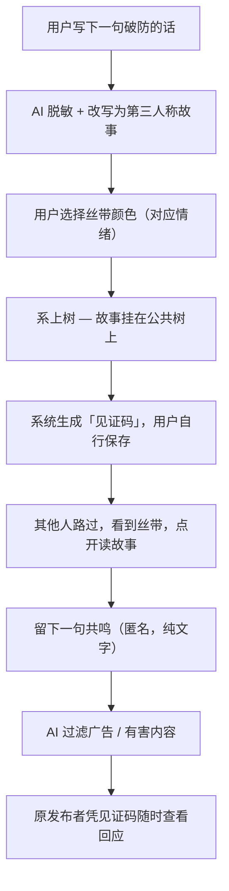

# PRD：TiedStory — 系上去的故事

> 本文档为 TiedStory 产品原始策划案，从项目创始对话中还原。

---

## 一、产品概述

**产品名称：** TiedStory（系上去的故事）

**域名：** tiedstory.com

**一句话定位：** 匿名倾诉平台，AI 将你的心事改写成故事，系上丝带，挂在树上，等人路过共鸣。

**核心价值：**
- 不是治疗，是**被看见**
- 不是倾诉对象，是**共鸣的容器**
- 匿名保护，AI 故事化处理保护隐私

---

## 二、产品背景与起源

产品最初源于对特殊儿童（自闭症）家长群体的关注。这类家长长期处于高压、孤立的情绪状态，缺乏疏导出口。

然而深入思考后，定位扩展为：**每个人都有破防的时刻**，特殊儿童家长是核心种子用户，但产品面向所有人。

**为什么用「丝带」而不是「漂流瓶」：**
- 漂流瓶意象已被滥用（网易、微信均有同类产品）
- 蓝色丝带是自闭症的国际象征，与种子用户群有天然连接
- 丝带系在树上，是一种仪式感的释放，不是"扔掉"，是"挂在这里，让风知道"
- 视觉上，一棵树挂满五颜六色的丝带，画面感极强，暗示"你不孤独，很多人也在这里"

---

## 三、核心流程 



**详细步骤说明：**

1. **输入心事**：用户匿名输入一句破防的话，无需注册登录
2. **AI 改写**：AI 脱敏处理（去除姓名、地点等隐私信息），以第三人称重新讲述这个故事
3. **选丝带颜色**：用户根据当前情绪选择丝带颜色
4. **系上树**：故事以"丝带"形态挂在公共的树上，所有路过的人都能看到
5. **见证码**：系统生成一串随机短码，用户自行保存。凭此码可查看收到的共鸣，无需账号
6. **他人共鸣**：路过的人打开丝带，读完故事后可留下一句匿名共鸣。不能私聊，谁也不知道谁是谁
7. **AI 守门**：对明显广告、有害内容自动拦截；对涉及自伤/危机的内容，附加心理援助热线而非直接拦截

---

## 四、丝带颜色与情绪对应

| 颜色 | 情绪 |
|------|------|
| 蓝色 | 悲伤、失落 |
| 橙色 | 愤怒、委屈 |
| 粉色 | 思念、心碎 |
| 绿色 | 疲惫、压力 |
| 紫色 | 迷茫、困惑 |
| 黄色 | 孤独、无助 |

---

## 五、AI 处理规范

### 5.1 脱敏规则
- 去除真实姓名（替换为"他 / 她 / 有一个人"）
- 去除具体地点（替换为模糊表述，如"某个城市"）
- 去除可识别的机构名、单位名
- 保留情绪核心，不改变事件本质

### 5.2 故事改写风格
- 第三人称叙述：以"有一个人……"或"她/他……"开头
- 语气：平静、克制，不煽情，不评判
- 长度：50~150字
- 绝对忠实原意，不添加虚构细节

### 5.3 有害内容分级处理
| 内容类型 | 处理方式 |
|----------|----------|
| 广告 / 推广 | 直接拦截，不发布 |
| 暴力 / 恐吓 | 直接拦截 |
| 涉及自伤 / 轻生 | **发布 + 附加心理援助热线**（不拦截，因为这是最需要被看见的声音） |
| 骂人 / 粗口 | 脱敏改写时过滤 |

---

## 六、数据库设计

```sql
-- 丝带（故事）表
CREATE TABLE stories (
    id          INTEGER PRIMARY KEY AUTOINCREMENT,
    original    TEXT NOT NULL,          -- 用户原始输入（私密）
    story       TEXT NOT NULL,          -- AI 改写后的故事（公开）
    color       TEXT NOT NULL,          -- 丝带颜色
    witness_code TEXT NOT NULL UNIQUE,  -- 见证码
    created_at  INTEGER NOT NULL,
    is_crisis   INTEGER DEFAULT 0       -- 是否触发危机检测
);

-- 共鸣（回响）表
CREATE TABLE resonances (
    id          INTEGER PRIMARY KEY AUTOINCREMENT,
    story_id    INTEGER NOT NULL REFERENCES stories(id),
    content     TEXT NOT NULL,          -- 共鸣内容
    created_at  INTEGER NOT NULL
);
```

---

## 七、技术栈

| 层级 | 技术选择 |
|------|----------|
| 后端框架 | FastAPI |
| 数据库 | SQLite |
| AI 模型 | 阿里云百炼 Qwen（`qwen3.6-plus`），关闭 Thinking |
| 前端 | Jinja2 模板 + 原生 HTML/CSS/JS |
| 图标 | Lucide SVG（本地引用，不依赖 CDN） |
| 部署端口 | 8000-9000 随机分配 |

---

## 八、产品边界（明确不做）

- ❌ 用户注册 / 登录 / 账号体系
- ❌ 私信 / 社交关系
- ❌ 医疗级心理干预
- ❌ 评论回复（只能留一句共鸣，不能展开讨论）
- ❌ 原发布者身份追踪

---

## 九、核心用户画像

**种子用户：** 特殊儿童（自闭症等）家长
- 长期处于高强度照护压力中
- 社会支持网络薄弱，难以倾诉
- 对隐私保护有强烈需求

**泛用户：** 所有有"破防时刻"的人
- 不需要找人倾诉，只需要"被看见"
- 匿名发布零门槛
